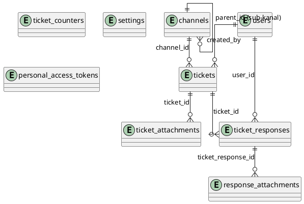
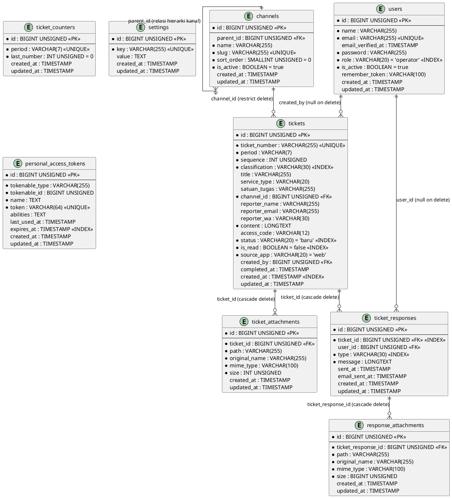

# Entity-Relationship Diagram (ERD) & Kamus Data - Aplikasi "Melati"

Dokumentasi ini menyajikan diagram ERD dan kamus data yang dianalisis secara presisi dari skema migrasi database (`database/migrations/*`) dan relasi model Eloquent (`app/Models/*`).

---

## 1. Diagram Ringkas Relasi Antar-Tabel (High-Level Conceptual ERD)

Diagram berikut menampilkan hubungan dan kardinalitas antar-tabel tanpa detail kolom untuk memberikan gambaran arsitektur data secara keseluruhan.

---

## 2. Diagram ERD Detail (Lengkap Kolom, Tipe Data, PK, FK, & Nullable)

Diagram berikut memuat seluruh tabel domain aplikasi Melati beserta tipe data, status wajib/nullable, primary key (`<<PK>>`), foreign key (`<<FK>>`), dan nilai bawaan (default value).

---

## 3. Kamus Data (Data Dictionary)

Berikut adalah detail rincian kamus data per entitas yang terdapat pada database aplikasi Melati.

### 3.1 Tabel `users`
Menyimpan data akun pengguna internal (Admin & Operator).

| Kolom | Tipe Data | Nullable | Keterangan / Aturan |
| --- | --- | --- | --- |
| `id` | BIGINT UNSIGNED | Tidak | Primary Key (Auto Increment) |
| `name` | VARCHAR(255) | Tidak | Nama lengkap pengguna |
| `email` | VARCHAR(255) | Tidak | Alamat email (Unique constraint) |
| `email_verified_at` | TIMESTAMP | Ya | Waktu verifikasi email |
| `password` | VARCHAR(255) | Tidak | Password terenkripsi (Hash) |
| `role` | VARCHAR(20) | Tidak | Peran pengguna: `'admin'` atau `'operator'` (Default: `'operator'`) |
| `is_active` | BOOLEAN | Tidak | Status aktif pengguna (Default: `true`) |
| `remember_token` | VARCHAR(100) | Ya | Token untuk fitur remember me |
| `created_at` | TIMESTAMP | Ya | Waktu data dibuat |
| `updated_at` | TIMESTAMP | Ya | Waktu data terakhir diubah |

---

### 3.2 Tabel `channels`
Menyimpan data kanal pengaduan dengan dukungan 2 level hierarki (kanal utama & sub-kanal).

| Kolom | Tipe Data | Nullable | Keterangan / Aturan |
| --- | --- | --- | --- |
| `id` | BIGINT UNSIGNED | Tidak | Primary Key (Auto Increment) |
| `parent_id` | BIGINT UNSIGNED | Ya | Foreign Key ke `channels.id` (Restrict on delete). `NULL` untuk kanal induk. |
| `name` | VARCHAR(255) | Tidak | Nama kanal (contoh: `'SP4N-LAPOR!'`, `'Sosial Media'`) |
| `slug` | VARCHAR(255) | Tidak | Slug unik kanal (contoh: `'sp4n-lapor'`, `'website'`) |
| `sort_order` | SMALLINT UNSIGNED | Tidak | Urutan tampilan (Default: `0`) |
| `is_active` | BOOLEAN | Tidak | Status kanal aktif (Default: `true`) |
| `created_at` | TIMESTAMP | Ya | Waktu data dibuat |
| `updated_at` | TIMESTAMP | Ya | Waktu data terakhir diubah |

---

### 3.3 Tabel `ticket_counters`
Menyimpan penghitung nomor urut bulanan (shared counter antar-klasifikasi) untuk mencegah bentrok/race condition.

| Kolom | Tipe Data | Nullable | Keterangan / Aturan |
| --- | --- | --- | --- |
| `id` | BIGINT UNSIGNED | Tidak | Primary Key (Auto Increment) |
| `period` | VARCHAR(7) | Tidak | Periode tahun-bulan unik (Format: `'YYYY-MM'`, contoh: `'2026-10'`) |
| `last_number` | INT UNSIGNED | Tidak | Nomor urut terakhir yang dipakai pada periode tersebut (Default: `0`) |
| `created_at` | TIMESTAMP | Ya | Waktu data dibuat |
| `updated_at` | TIMESTAMP | Ya | Waktu data terakhir diubah |

---

### 3.4 Tabel `tickets`
Menyimpan seluruh data laporan utama (Pengaduan, Aspirasi, Permintaan Informasi).

| Kolom | Tipe Data | Nullable | Keterangan / Aturan |
| --- | --- | --- | --- |
| `id` | BIGINT UNSIGNED | Tidak | Primary Key (Auto Increment) |
| `ticket_number` | VARCHAR(255) | Tidak | Nomor unik tiket (Publik: `P-1400/MMYYYY/XX01`, Admin: `Nama/DDMMYYYY/01`) |
| `period` | VARCHAR(7) | Tidak | Periode tiket (Format: `'YYYY-MM'`) |
| `sequence` | INT UNSIGNED | Tidak | Nomor urut gabungan dalam periode |
| `classification` | VARCHAR(30) | Tidak | Klasifikasi: `'pengaduan'`, `'aspirasi'`, `'permintaan_informasi'` |
| `title` | VARCHAR(255) | Ya | Judul laporan |
| `service_type` | VARCHAR(20) | Ya | Jenis layanan khusus Pengaduan: `'pst'` atau `'lainnya'` |
| `satuan_tugas` | VARCHAR(255) | Ya | Satuan tugas khusus Aspirasi |
| `channel_id` | BIGINT UNSIGNED | Tidak | Foreign Key ke `channels.id` |
| `reporter_name` | VARCHAR(255) | Ya | Nama lengkap pelapor |
| `reporter_email` | VARCHAR(255) | Ya | Alamat email pelapor (dipakai untuk balasan kirim email) |
| `reporter_wa` | VARCHAR(30) | Ya | Nomor WhatsApp pelapor |
| `content` | LONGTEXT | Tidak | Isi uraian laporan |
| `access_code` | VARCHAR(12) | Ya | Kode akses unik acak untuk pelapor |
| `status` | VARCHAR(20) | Tidak | Status tiket: `'baru'`, `'respon_awal'`, `'respon_substantif'`, `'selesai'` |
| `is_read` | BOOLEAN | Tidak | Penanda inbox laporan belum/sudah dibaca (Default: `false`) |
| `source_app` | VARCHAR(20) | Tidak | Asal pembuatan tiket: `'web'`, `'android'`, `'admin'`, `'flutter'` |
| `created_by` | BIGINT UNSIGNED | Ya | Foreign Key ke `users.id` (Null on delete). Terisi jika dibuat oleh admin/operator |
| `completed_at` | TIMESTAMP | Ya | Waktu tiket ditandai/berstatus selesai |
| `created_at` | TIMESTAMP | Ya | Waktu tiket dibuat |
| `updated_at` | TIMESTAMP | Ya | Waktu tiket terakhir diubah |

*Catatan Constraint:* Unique Key gabungan `(period, sequence)`. Index pada `(classification, status)`, `(status, is_read)`, dan `created_at`.

---

### 3.5 Tabel `ticket_attachments`
Menyimpan file berkas lampiran pendukung saat tiket dibuat.

| Kolom | Tipe Data | Nullable | Keterangan / Aturan |
| --- | --- | --- | --- |
| `id` | BIGINT UNSIGNED | Tidak | Primary Key (Auto Increment) |
| `ticket_id` | BIGINT UNSIGNED | Tidak | Foreign Key ke `tickets.id` (Cascade on delete) |
| `path` | VARCHAR(255) | Tidak | Relative path lokasi penyimpanan file di storage public |
| `original_name` | VARCHAR(255) | Tidak | Nama asli file saat diunggah |
| `mime_type` | VARCHAR(100) | Tidak | Mime type berkas (contoh: `'image/png'`, `'application/pdf'`) |
| `size` | INT UNSIGNED | Tidak | Ukuran berkas dalam satuan byte |
| `created_at` | TIMESTAMP | Ya | Waktu file diunggah |
| `updated_at` | TIMESTAMP | Ya | Waktu data diubah |

---

### 3.6 Tabel `ticket_responses`
Menyimpan riwayat tanggapan/percakapan dari petugas BPS maupun balasan dari pelapor.

| Kolom | Tipe Data | Nullable | Keterangan / Aturan |
| --- | --- | --- | --- |
| `id` | BIGINT UNSIGNED | Tidak | Primary Key (Auto Increment) |
| `ticket_id` | BIGINT UNSIGNED | Tidak | Foreign Key ke `tickets.id` (Cascade on delete) |
| `user_id` | BIGINT UNSIGNED | Ya | Foreign Key ke `users.id` (Null on delete). `NULL` apabila balasan dikirim oleh pelapor. |
| `type` | VARCHAR(30) | Tidak | Jenis respon: `'respon_awal'`, `'respon_substantif'`, atau `'balasan_pelapor'` |
| `message` | LONGTEXT | Tidak | Isi tanggapan/balasan |
| `sent_at` | TIMESTAMP | Ya | Waktu pesan dikirim |
| `email_sent_at` | TIMESTAMP | Ya | Waktu notifikasi email terkirim ke pelapor |
| `created_at` | TIMESTAMP | Ya | Waktu data dibuat |
| `updated_at` | TIMESTAMP | Ya | Waktu data diubah |

---

### 3.7 Tabel `response_attachments`
Menyimpan file lampiran berkas pendukung pada tanggapan/balasan.

| Kolom | Tipe Data | Nullable | Keterangan / Aturan |
| --- | --- | --- | --- |
| `id` | BIGINT UNSIGNED | Tidak | Primary Key (Auto Increment) |
| `ticket_response_id` | BIGINT UNSIGNED | Tidak | Foreign Key ke `ticket_responses.id` (Cascade on delete) |
| `path` | VARCHAR(255) | Tidak | Relative path lokasi file di storage public |
| `original_name` | VARCHAR(255) | Tidak | Nama asli berkas |
| `mime_type` | VARCHAR(100) | Tidak | Mime type berkas |
| `size` | BIGINT UNSIGNED | Tidak | Ukuran berkas dalam byte |
| `created_at` | TIMESTAMP | Ya | Waktu file diunggah |
| `updated_at` | TIMESTAMP | Ya | Waktu data diubah |

---

### 3.8 Tabel `settings`
Menyimpan konfigurasi dinamis aplikasi (key-value) seperti data penanda tangan laporan dan batas hari auto-close.

| Kolom | Tipe Data | Nullable | Keterangan / Aturan |
| --- | --- | --- | --- |
| `id` | BIGINT UNSIGNED | Tidak | Primary Key (Auto Increment) |
| `key` | VARCHAR(255) | Tidak | Key pengaturan unik (contoh: `'nama_penanda_tangan'`, `'auto_close_pengaduan_days'`) |
| `value` | TEXT | Ya | Nilai konfigurasi |
| `created_at` | TIMESTAMP | Ya | Waktu dibuat |
| `updated_at` | TIMESTAMP | Ya | Waktu diubah |

---

### 3.9 Tabel `personal_access_tokens`
Menyimpan token autentikasi API Sanctum untuk aplikasi/klien eksternal.

| Kolom | Tipe Data | Nullable | Keterangan / Aturan |
| --- | --- | --- | --- |
| `id` | BIGINT UNSIGNED | Tidak | Primary Key (Auto Increment) |
| `tokenable_type` | VARCHAR(255) | Tidak | Class model pemilik token (Polymorphic) |
| `tokenable_id` | BIGINT UNSIGNED | Tidak | ID instance pemilik token (Polymorphic) |
| `name` | TEXT | Tidak | Nama identifikasi token |
| `token` | VARCHAR(64) | Tidak | Hash token unik (Unique constraint) |
| `abilities` | TEXT | Ya | Hak akses token (JSON string) |
| `last_used_at` | TIMESTAMP | Ya | Waktu terakhir token digunakan |
| `expires_at` | TIMESTAMP | Ya | Waktu kedaluwarsa token |
| `created_at` | TIMESTAMP | Ya | Waktu token dibuat |
| `updated_at` | TIMESTAMP | Ya | Waktu token diubah |
