# Flowchart Alur Kerja Pelapor (Publik / User) - Aplikasi "Melati"

Dokumentasi ini menjelaskan alur kerja lengkap dari sisi **Pelapor (Publik / User)** pada aplikasi pelaporan **Melati** (Laravel 11 + Inertia.js + React), mulai dari pengajuan laporan awal hingga laporan dinyatakan selesai.

---

## 1. Diagram Flowchart PlantUML

Diagram di bawah ini menggambarkan seluruh tahapan alur kerja pelapor, termasuk percabangan validasi, responsivitas input per klasifikasi, loop tanggapan/balasan, serta mekanisme penutupan tiket (manual & auto-close).

```plantuml
@startuml
skinparam conditionStyle diamond
skinparam linetype ortho
skinparam monochrome false

start

partition "1. Pengajuan Laporan Baru" {
  :Pelapor membuka halaman Web (`/`) atau aplikasi mobile (API `/api/tickets`);
  :Pelapor memilih Jenis Klasifikasi Laporan:
  - Pengaduan (Laporan Masalah)
  - Aspirasi (Saran & Masukan)
  - Permintaan Informasi (Permohonan Data);
  :Pelapor mengisi Form Laporan:
  - Judul Laporan (min 3, max 255 kar)
  - Isi Uraian Laporan (min 10 kar)
  - Sumber Kanal (Default: Website / Pilihan)
  - Data Pelapor: Nama, Email, No. WA (Opsional);

  if (Klasifikasi Laporan?) then (Pengaduan)
    :Pilih Jenis Layanan: PST / Lainnya;
  else if (Aspirasi) then (Aspirasi)
    :Isi Satuan Tugas (Wajib jika via Non-Web API);
  else (Permintaan Informasi)
    :Form standar (tanpa field khusus);
  endif

  if (Mengunggah Lampiran Berkas?) then (Ya)
    :Pilih Berkas Lampiran:
    - Maksimal 3 file
    - Format: JPG, JPEG, PNG, PDF
    - Ukuran per file max 2MB;
  else (Tidak)
  endif

  :Pelapor menekan tombol "Kirim Laporan";
}

partition "2. Validasi Data & Pembuatan Tiket" {
  if (Validasi Input Berhasil?) then (Tidak)
    :Sistem mengembalikan pesan kesalahan (validation errors);
    :Pelapor memperbaiki data pada Form Laporan;
    detach
  else (Ya)
    :Sistem membuat nomor tiket unik sekuensial:
    - Pengaduan: `L-1400/MMYYYY/XX01`
    - Aspirasi: `A-1400/MMYYYY/XX01`
    - Permintaan Informasi: `I-1400/MMYYYY/XX01`
    *(menggunakan Redis Lock & TicketCounter)*;
    :Sistem membuat `access_code` acak (12 karakter);
    :Sistem menyimpan data tiket (Status: `baru`, `is_read`: `false`);

    if (Ada Berkas Lampiran?) then (Ya)
      :Sistem menyimpan berkas di `storage/app/public/attachments/{ticket_id}`;
      :Sistem mencatat record pada `ticket_attachments`;
    else (Tidak)
    endif

    :Sistem menyimpan cache tiket di Redis (24 jam);
    :Sistem memicu event broadcasting real-time `TicketCreated`;
    :Sistem menampilkan Dialog Modal Nomor Tiket ke Pelapor;
    :Nomor tiket disimpan otomatis di `localStorage` browser (`melati_tickets`);
  endif
}

partition "3. Pemantauan & Cek Status Tiket" {
  :Pelapor membuka halaman Cek Tiket (`/check` atau API `GET /api/check/{ticketNumber}`);
  :Pelapor memasukkan Nomor Tiket;
  
  if (Nomor Tiket Ditemukan?) then (Tidak)
    :Sistem menampilkan pesan "Nomor tiket tidak ditemukan";
    stop
  else (Ya)
    :Sistem menjalankan fungsi `checkAndAutoClose()`:
    Memeriksa apakah tiket kedaluwarsa berdasarkan setting hari;
    :Sistem menampilkan Detail Tiket, Lampiran, & Riwayat Tanggapan;
  endif
}

partition "4. Tanggapan Petugas & Loop Balasan Pelapor" {
  if (Petugas BPS Memberikan Tanggapan?) then (Ya)
    :Tanggapan tersimpan di `ticket_responses` (Type: `respon_awal` / `respon_substantif`);
    :Status tiket diperbarui sesuai jenis respon;

    if (Pelapor Memiliki Alamat Email?) then (Ya)
      :Sistem mengirimkan email notifikasi `TicketResponseSubmitted` ke Pelapor;
    else (Tidak)
    endif

    if (Pelapor Ingin Membalas Tanggapan?) then (Ya)
      if (Status Tiket = Selesai?) then (Ya)
        :Sistem menolak balasan: "Tiket telah selesai";
        stop
      else (Tidak)
        :Pelapor menulis Pesan Balasan (min 5 kar) & mengunggah lampiran (max 3 file);
        :Sistem menyimpan balasan (`user_id = null`, type: `balasan_pelapor`);
        :Sistem mengubah `is_read = false` pada tiket agar muncul notifikasi inbox petugas;
        :Sistem mengosongkan `completed_at`;
      endif
    else (Tidak)
    endif
  else (Belum Dibalas)
    :Tiket tetap berstatus `baru` (Menunggu Tanggapan);
  endif
}

partition "5. Penyelesaian Tiket (Completion)" {
  if (Mekanisme Penyelesaian Tiket?) then (Manual oleh Pelapor)
    :Pelapor menekan tombol "Tandai Selesai" (`POST /check/{ticketNumber}/complete`);
    :Sistem mengupdate `status = selesai` & `completed_at = now()`;
  else (Auto-Close Otomatis oleh Sistem)
    :Scheduler Artisan `tickets:auto-close` (hourly) / Check pemicu berjalan;
    :Sistem mengecek batas hari auto-close per klasifikasi (`settings`):
    - Pengaduan (default: 3 hari)
    - Aspirasi (default: 1 hari)
    - Permintaan Informasi (default: 5 hari);
    if (Selisih waktu dari respon terakhir petugas >= batas hari?) then (Ya)
      :Sistem otomatis mengubah `status = selesai` & `completed_at = now()`;
    else (Belum Kedaluwarsa)
      :Tiket tetap aktif;
    endif
  endif

  :Status Tiket Resmi Selesai;
}

stop
@enduml
```

---

## 2. Penjelasan Rinci Tahapan Alur Kerja

### Tahap 1: Pengajuan Laporan Baru (`welcome.tsx` / `TicketController@store` / `TicketApiController@store`)
1. **Akses Layanan**: Pelapor membuka halaman web Melati (`/`) atau mengirim request HTTP via aplikasi mobile (`POST /api/tickets`).
2. **Pemilihan Klasifikasi**: Pelapor memilih salah satu dari 3 klasifikasi laporan:
   - **Pengaduan**: Laporan terkait masalah atau kendala pelayanan.
   - **Aspirasi**: Saran, ide, atau masukan untuk BPS.
   - **Permintaan Informasi**: Permohonan data statistik atau informasi publik.
3. **Pengisian Formulir**:
   - *Field Umum*: Judul Laporan (`title`, 3-255 karakter), Isi Laporan (`content`, minimal 10 karakter), Sumber Kanal (`channel_id`, default: Website), serta data diri opsional (Nama, Email, No. WA/HP).
   - *Field Khusus Pengaduan*: Jenis Layanan (`service_type`: `'pst'` / `'lainnya'`).
   - *Field Khusus Aspirasi*: Satuan Tugas (`satuan_tugas`).
4. **Lampiran Berkas**: Pelapor secara opsional dapat mengunggah hingga **3 berkas** lampiran (format: `.jpg`, `.jpeg`, `.png`, `.pdf`, ukuran maksimal 2MB per file).

---

### Tahap 2: Validasi Data & Pembuatan Tiket (`StoreTicketRequest.php` & `Ticket.php`)
1. **Pengecekan Validasi**:
   - Jika validasi gagal (misal: isi kurang dari 10 karakter, format email salah, file > 2MB), sistem mengembalikan error validasi ke halaman form.
   - Jika validasi berhasil, sistem melanjutkan proses transaksi.
2. **Generasi Nomor Tiket Sekuensial**:
   - Sistem mengambil periode berjalan (contoh: `'2026-10'`).
   - Menggunakan **Redis Lock** (`Cache::lock`) dan tabel `ticket_counters` untuk menambah nomor urut secara aman tanpa risiko duplikasi (*race condition*).
   - Format nomor tiket: `{Prefix}-1400/{MMYYYY}/{AcakHuruf}{NomorUrut}`
     - Example: `L-1400/102026/AB01` (Pengaduan), `A-1400/102026/XY02` (Aspirasi), `I-1400/102026/RK03` (Permintaan Informasi).
3. **Penyimpanan Data**:
   - Record tiket disimpan ke tabel `tickets` dengan status awal `'baru'` dan `is_read = false`.
   - Berkas fisik lampiran disimpan di `storage/app/public/attachments/{ticket_id}` dan dicatat di `ticket_attachments`.
   - Data sementara disimpan di Redis cache selama 24 jam (`ticket:{ticket_number}`).
   - Event broadcasting real-time `TicketCreated` didispatch ke sistem/dashboard admin.
4. **Pemberitahuan Nomor Tiket**:
   - Halaman web menampilkan Dialog Modal berisi Nomor Tiket yang berhasil dibuat.
   - Nomor tiket otomatis tersimpan di `localStorage` browser (`melati_tickets`) sehingga pelapor dapat melihat riwayat tiket yang pernah dibuatnya.

---

### Tahap 3: Pemantauan & Cek Status Tiket (`check.tsx` / `CheckTicketController`)
1. Pelapor membuka rute `/check` atau API `GET /api/check?ticket_number=...`.
2. Sistem melakukan pencarian pada database berdasarkan `ticket_number`.
3. Setiap kali tiket diperiksa, sistem memicu fungsi helper `checkAndAutoClose()` untuk memastikan status tiket diperbarui jika telah melewati batas hari auto-close.
4. Halaman menampilkan:
   - Data umum tiket & status berjalan (`Menunggu Tanggapan`, `Respon Awal`, `Respon Substantif`, `Selesai`).
   - Tautan unduh/preview lampiran berkas tiket.
   - Riwayat percakapan/tanggapan dari petugas BPS.

---

### Tahap 4: Tanggapan Petugas & Loop Balasan Pelapor (`TicketResponseController` & `CheckTicketController@reply`)
1. **Tanggapan Petugas BPS**:
   - Petugas memberikan tanggapan berupa `respon_awal` atau `respon_substantif`.
   - Status tiket berubah sesuai tipe respon.
   - Apabila pelapor mencantumkan email (`reporter_email`), sistem secara otomatis mengirimkan email notifikasi berisi rincian tanggapan via Mailable `TicketResponseSubmitted`.
2. **Balasan dari Pelapor**:
   - Selama status tiket **belum** `'selesai'`, pelapor dapat mengirimkan balasan pesan (minimal 5 karakter) dan melampirkan berkas baru (maksimal 3 file) melalui tombol balasan di halaman `/check`.
   - Balasan pelapor disimpan ke `ticket_responses` dengan `user_id = null` dan `type = 'balasan_pelapor'`.
   - Tiket ditandai `is_read = false` agar muncul penanda inbox laporan masuk bagi petugas BPS.

---

### Tahap 5: Penyelesaian Tiket (`CheckTicketController@complete` & `AutoCloseTicketsCommand.php`)
Tiket dapat berubah status menjadi `'selesai'` melalui 2 mekanisme:

1. **Secara Manual oleh Pelapor**:
   - Pelapor menekan tombol **"Tandai Selesai"** pada halaman cek tiket (`POST /check/{ticketNumber}/complete` atau API `POST /api/check/{ticketNumber}/complete`).
   - Sistem memperbarui `status = 'selesai'` dan mencatat timestamp `completed_at = now()`.

2. **Secara Otomatis oleh Sistem (Auto-Close)**:
   - Perintah terjadwal Artisan (`tickets:auto-close`) berjalan setiap jam via Cron Laravel Scheduler (`routes/console.php`).
   - Pengecekan juga dipicu saat pelapor membuka detail tiket di rute `/check`.
   - Sistem menghitung selisih waktu sejak tanggapan terakhir petugas BPS (`user_id != null`).
   - Apabila selisih hari melebihi konfigurasi pada tabel `settings`:
     - Pengaduan: `auto_close_pengaduan_days` (default: 3 hari)
     - Aspirasi: `auto_close_aspirasi_days` (default: 1 hari)
     - Permintaan Informasi: `auto_close_permintaan_informasi_days` (default: 5 hari)
   - Maka sistem otomatis mengubah `status = 'selesai'` dan mencatat `completed_at = now()`.

---

## 3. Matriks Aturan Bisnis & Validasi Pelapor

| Fitur / Tahap | Aturan Bisnis / Validasi | Lokasi Kode |
| --- | --- | --- |
| **Judul Laporan** | Wajib, string, 3 - 255 karakter | `StoreTicketRequest.php` |
| **Isi Laporan** | Wajib, string, minimal 10 karakter | `StoreTicketRequest.php` |
| **Klasifikasi** | Wajib, salah satu dari: `pengaduan`, `aspirasi`, `permintaan_informasi` | `StoreTicketRequest.php` |
| **Kanal Pengaduan** | Wajib. Default ke kanal `'website'` jika tidak diisi | `StoreTicketRequest.php` |
| **Format File Lampiran** | Berkas opsional, maks 3 file, format `jpg`, `jpeg`, `png`, `pdf`, max 2MB/file | `StoreTicketRequest.php` |
| **Generasi Nomor Tiket** | Format `P-1400/MMYYYY/XX01`, aman dari race condition menggunakan Redis Lock | `Ticket::generateTicketNumber()` |
| **Notasi Status Tiket** | `baru` $\rightarrow$ `respon_awal` / `respon_substantif` $\rightarrow$ `selesai` | `Ticket.php` & Controller |
| **Kirim Email Tanggapan** | Dikirim otomatis jika `reporter_email` terisi via Mailable `TicketResponseSubmitted` | `TicketResponseController.php` |
| **Balasan Pelapor** | Minimal 5 karakter pesan, `user_id = null`, me-reset `is_read = false` | `CheckTicketController@reply` |
| **Batas Auto-Close** | Konfigurasi dinamis per klasifikasi di tabel `settings` (Pengaduan: 3 hari, Aspirasi: 1 hari, Permintaan Info: 5 hari) | `Ticket::autoCloseExpiredTickets()` |

---

## 4. Catatan Asumsi & Keterbatasan

1. **Otentikasi Pelapor**: Pelapor tidak diwajibkan melakukan registrasi/login akun. Akses ke tiket murni menggunakan **Nomor Tiket** (`ticket_number`) yang dihasilkan oleh sistem.
2. **Penyimpanan Lokal Browser**: Riwayat nomor tiket pelapor disimpan di `localStorage` per peramban (`melati_tickets`). Jika pelapor membersihkan cache/data browser atau menggunakan perangkat lain, pelapor harus menyimpan/mencatat Nomor Tiket secara manual.
3. **Mekanisme Auto-Close**: Pengecekan auto-close berjalan melalui 2 pintu: secara berkala setiap jam via Laravel Artisan Scheduler `tickets:auto-close` dan secara real-time *on-demand* saat rute pengecekan `/check` diakses oleh pelapor.
