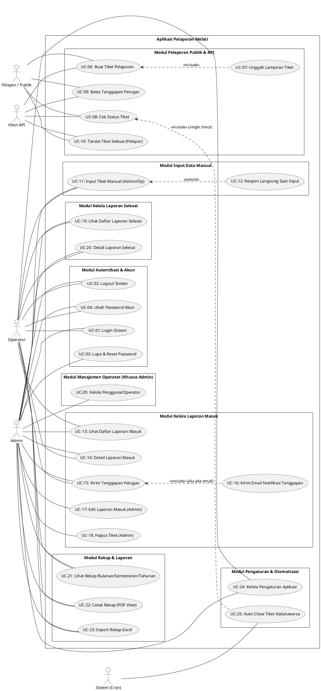
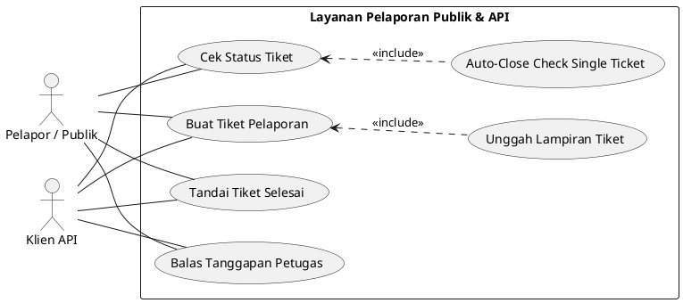
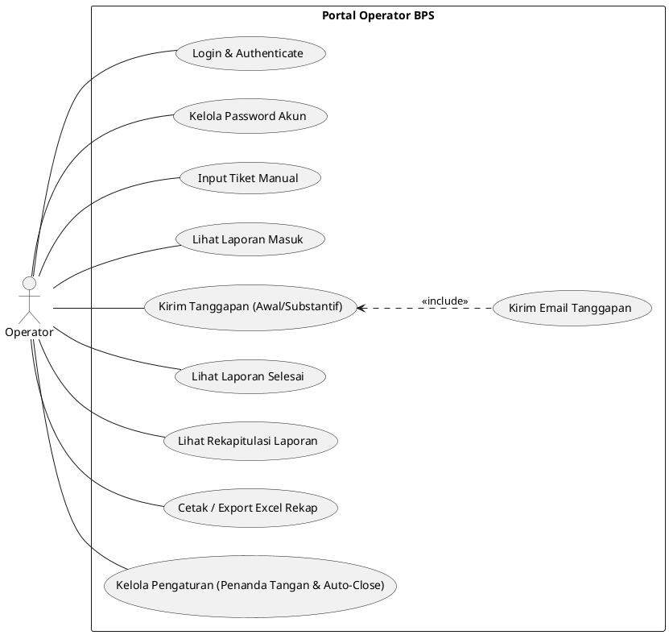
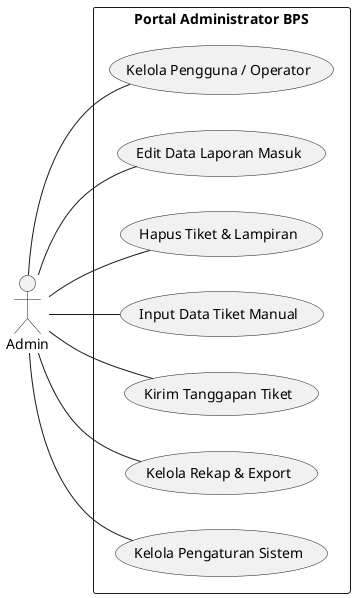
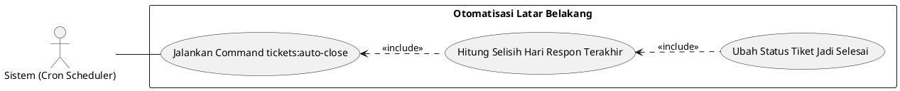

# Dokumentasi Use Case - Aplikasi Pelaporan "Melati"

Dokumentasi ini disusun berdasarkan analisis langsung terhadap kode sumber proyek aplikasi pelaporan **Melati** (Laravel + Inertia + React).

---

## 1. Identifikasi Aktor & Hak Akses

Berdasarkan pemeriksaan middleware (`EnsureUserHasRole`, `EnsureApiKeyIsValid`), rute (`routes/web.php`, `routes/api.php`), controller, dan perintah konsol (`tickets:auto-close`), berikut adalah aktor-aktor yang terlibat dalam sistem:

| Aktor | Jenis | Deskripsi | Hak Akses |
| --- | --- | --- | --- |
| **Pelapor / Publik** | Pengguna Eksternal | Masyarakat / pengguna umum yang mengajukan atau memantau laporan tanpa memerlukan akun login. | - Membuat laporan publik (Pengaduan, Aspirasi, Permintaan Informasi) - Mengunggah file lampiran tiket - Mengecek status tiket via Nomor Tiket - Membalas tanggapan petugas BPS - Menandai tiket selesai secara mandiri |
| **Operator** | Pengguna Internal | Petugas penanganan laporan BPS dengan rute `/dashboard/operator`. | - Akses Ringkasan & Tren Dashboard Operator - Input data laporan manual (sumber admin) - Mengelola & merespon Laporan Masuk (Respon Awal / Respon Substantif) - Mengirim email tanggapan ke pelapor - Melihat & memfilter Laporan Selesai - Melihat, mencetak (PDF view), dan mengunduh Excel Rekap (Bulanan, Semesteran, Tahunan) - Mengubah Pengaturan Aplikasi (Penanda Tangan & Auto-Close Days) - Mengubah Password & Tampilan Profil Akun |
| **Admin** | Pengguna Internal | Pengelola sistem utama dengan role `admin` dan rute `/dashboard/admin`. | - Memiliki seluruh hak akses **Operator** - Mengelola Pengguna/Operator (Tambah, Edit, Hapus akun) - Mengedit data Laporan Masuk (Ubah pelapor, judul, isi) - Menghapus data Tiket beserta seluruh lampirannya |
| **Klien API (Aplikasi Eksternal)** | Pengguna Sistem Eksternal | Aplikasi pihak ketiga (misal: Flutter/Android) yang berkomunikasi via rute `/api/*` dengan autenfikasi `X-API-KEY`. | - Membuat tiket via API (`POST /api/tickets`) - Memeriksa status tiket (`GET /api/check`) - Mengirim balasan pelapor (`POST /api/check/{ticket}/reply`) - Menandai tiket selesai (`POST /api/check/{ticket}/complete`) |
| **Sistem (Cron Scheduler)** | Aktor Otomatis | Perintah terjadwal Artisan (`tickets:auto-close`) yang dijalankan setiap jam (`hourly`). | - Memeriksa tiket aktif yang sudah ditanggapi petugas - Menutup tiket secara otomatis jika melampaui batas hari auto-close |

---

## 2. Diagram Use Case Keseluruhan

Diagram di bawah menggambarkan seluruh interaksi antara aktor dan modul-modul utama sistem Melati.

---

## 3. Diagram Use Case Per Aktor

### 3.1 Use Case Aktor Pelapor / Publik & Klien API

### 3.2 Use Case Aktor Operator

### 3.3 Use Case Aktor Admin

### 3.4 Use Case Aktor Sistem (Cron Scheduler)

---

## 4. Tabel Deskripsi Use Case

| ID | Nama Use Case | Aktor Utama | Prasyarat | Alur Utama | Hasil / Output |
| --- | --- | --- | --- | --- | --- |
| **UC-01** | Login Sistem | Admin, Operator | Pengguna belum login, akun aktif (`is_active = true`) | 1. Pengguna membuka halaman `/login`. 2. Mengisi email dan password. 3. Sistem memvalidasi kredensial. 4. Sistem mengarahkan Admin ke `/dashboard/admin` atau Operator ke `/dashboard/operator`. | Sesi autentikasi terbentuk. |
| **UC-02** | Logout Sistem | Admin, Operator | Pengguna sedang login | 1. Pengguna menekan tombol Logout. 2. Sistem menghapus sesi autentikasi. 3. Pengguna diarahkan kembali ke halaman Login. | Sesi autentikasi berakhir. |
| **UC-03** | Lupa & Reset Password | Admin | Email terdaftar | 1. Pengguna meminta link reset password. 2. Sistem mengirimkan link reset via email. 3. Pengguna membuka link dan memasukkan password baru. | Password akun berhasil diperbarui. |
| **UC-04** | Ubah Password Akun | Admin, Operator | Pengguna sedang login | 1. Pengguna membuka `/settings/password`. 2. Memasukkan password lama dan password baru. 3. Sistem memverifikasi dan mengupdate password. | Password akun berhasil diperbarui. |
| **UC-05** | Kelola Pengguna/Operator | Admin | Admin sedang login | 1. Admin membuka rute `dashboard/admin/operator`. 2. Admin dapat melihat daftar pengguna, menambah pengguna baru (`admin`/`operator`), mengubah data pengguna, atau menghapus pengguna. | Data akun pengguna bertambah, berubah, atau terhapus. |
| **UC-06** | Buat Tiket Pelaporan | Pelapor, Klien API | Tersedia kanal pengaduan aktif | 1. Pelapor memilih klasifikasi (Pengaduan, Aspirasi, Permintaan Informasi). 2. Mengisi judul, kanal, data diri, dan isi laporan. 3. Sistem men-generate nomor tiket unik (misal: `L-1400/102026/AB01`). 4. Sistem menyimpan tiket dan men-dispatch event broadcasting `TicketCreated`. | Tiket baru tersimpan dengan status `baru`. |
| **UC-07** | Unggah Lampiran Tiket | Pelapor, Klien API | Pembuatan tiket sedang berlangsung | 1. Pelapor memilih file (JPG, PNG, PDF, max 2MB). 2. Sistem menyimpan file di storage public (`attachments/{ticket_id}`). | Data lampiran tersimpan di `ticket_attachments`. |
| **UC-08** | Cek Status Tiket | Pelapor, Klien API | Nomor tiket valid | 1. Pelapor menginput Nomor Tiket di rute `/check` atau API. 2. Sistem menjalankan pengecekan auto-close tiket tersebut. 3. Sistem menampilkan detail tiket, status, dan riwayat balasan. | Informasi detail tiket dan riwayat respon tampil. |
| **UC-09** | Balas Tanggapan Petugas | Pelapor, Klien API | Tiket belum berstatus `selesai` | 1. Pelapor mengisi pesan balasan pada detail tiket. 2. Sistem menyimpan respon dengan `user_id = null` dan `type = balasan_pelapor`. 3. Sistem mengubah `is_read = false` pada tiket agar muncul penanda di admin. | Balasan pelapor tersimpan dan tiket ditandai belum dibaca oleh admin. |
| **UC-10** | Tandai Tiket Selesai (Pelapor) | Pelapor, Klien API | Tiket berstatus aktif | 1. Pelapor menekan tombol "Tandai Selesai". 2. Sistem mengupdate `status = selesai` dan mengisi `completed_at`. | Status tiket berubah menjadi `selesai`. |
| **UC-11** | Input Tiket Manual | Admin, Operator | User internal sedang login | 1. Pengguna membuka menu "Input Data". 2. Mengisi formulir tiket yang bersumber dari offline/admin. 3. Sistem men-generate nomor tiket berbasis nama pembuat (misal: `Administrator/09102026/01`). | Tiket baru tersimpan dengan `source_app = admin`. |
| **UC-12** | Respon Langsung Saat Input | Admin, Operator | Pengguna mengisi input tiket manual | 1. Pengguna secara opsional memilih untuk memberikan tanggapan langsung saat menginput tiket. 2. Sistem membuat `ticket_responses` dan langsung mengubah tiket ke status `selesai`. | Tiket langsung tersimpan dalam kondisi selesai direspon. |
| **UC-13** | Lihat Daftar Laporan Masuk | Admin, Operator | User internal sedang login | 1. Pengguna membuka rute `laporan-masuk`. 2. Sistem menampilkan tiket dari publik (kecuali `source_app = admin`) beserta statistik tab/filter. | Daftar tiket laporan masuk tampil. |
| **UC-14** | Detail Laporan Masuk | Admin, Operator | User internal sedang login | 1. Pengguna memilih salah satu tiket. 2. Sistem otomatis mengubah `is_read = true` jika sebelumnya `false`. 3. Menampilkan riwayat percakapan dan lampiran. | Detail tiket tampil & status dibaca diperbarui. |
| **UC-15** | Kirim Tanggapan Petugas | Admin, Operator | User internal sedang login | 1. Pengguna memilih tipe respon (`respon_awal` atau `respon_substantif`) dan menulis pesan. 2. Sistem menyimpan respon dengan `user_id = auth()->id()`. 3. Status tiket terupdate sesuai tipe respon. | Tanggapan petugas tersimpan dan status tiket terupdate. |
| **UC-16** | Kirim Email Notifikasi Tanggapan | Admin, Operator | Tiket memiliki `reporter_email` | 1. Setelah respon petugas disimpan, sistem memeriksa ketersediaan email pelapor. 2. Mengirim email mailable `TicketResponseSubmitted`. 3. Catat `email_sent_at` pada respon. | Email tanggapan terkirim ke alamat email pelapor. |
| **UC-17** | Edit Laporan Masuk | Admin | Admin sedang login | 1. Admin membuka detail tiket pada rute `laporan-masuk/{ticketNumber}`. 2. Admin memperbarui nama pelapor, email, WA, judul, atau isi content. | Data tiket berhasil diperbarui. |
| **UC-18** | Hapus Tiket | Admin | Admin sedang login | 1. Admin menekan tombol Hapus pada tiket. 2. Sistem menghapus seluruh file fisik lampiran tiket dan respon di storage. 3. Sistem menghapus record tiket dari database via transaksi DB. | Tiket dan seluruh lampiran terhapus bersih. |
| **UC-19** | Lihat Daftar Laporan Selesai | Admin, Operator | User internal sedang login | 1. Pengguna membuka rute `laporan-selesai`. 2. Sistem menampilkan tiket berstatus `respon_awal`, `respon_substantif`, atau `selesai`. | Daftar laporan selesai tampil. |
| **UC-20** | Detail Laporan Selesai | Admin, Operator | User internal sedang login | 1. Pengguna membuka detail laporan selesai. 2. Sistem menampilkan seluruh percakapan & berkas lampiran. | Detail laporan selesai tampil read-only. |
| **UC-21** | Lihat Rekapitulasi Laporan | Admin, Operator | User internal sedang login | 1. Pengguna membuka menu Rekap (Bulanan, Semesteran, atau Tahunan). 2. Sistem mengagregasikan tiket per kanal (induk & anak) dan per klasifikasi. | Tabel matriks rekapitulasi tampil. |
| **UC-22** | Cetak Rekap (PDF View) | Admin, Operator | User internal sedang login | 1. Pengguna menekan tombol "Cetak". 2. Sistem rendernya via blade template print khusus siap cetak/pdf iframe lengkap dengan penanda tangan. | Tampilan dokumen siap cetak/simpan PDF. |
| **UC-23** | Export Rekap Excel | Admin, Operator | User internal sedang login | 1. Pengguna menekan tombol "Export Excel". 2. Sistem mengunduh file `.xls` berformat tabel rekap. | File `.xls` terunduh. |
| **UC-24** | Kelola Pengaturan Aplikasi | Admin, Operator | User internal sedang login | 1. Pengguna membuka rute `pengaturan`. 2. Mengubah nama, jabatan, kota penanda tangan, serta batas hari auto-close per klasifikasi. 3. Sistem mengupdate data di tabel `settings`. | Pengaturan sistem terupdate. |
| **UC-25** | Auto-Close Tiket Kedaluwarsa | Sistem (Cron) | Jadwal hourly tercapai | 1. Perintah `tickets:auto-close` berjalan. 2. Sistem mencari tiket aktif yang respon terakhirnya dari petugas BPS. 3. Menghitung batas kedaluwarsa sesuai `settings`. 4. Mengubah status ke `selesai` jika sudah melampaui batas hari. | Tiket kedaluwarsa otomatis ditutup. |
